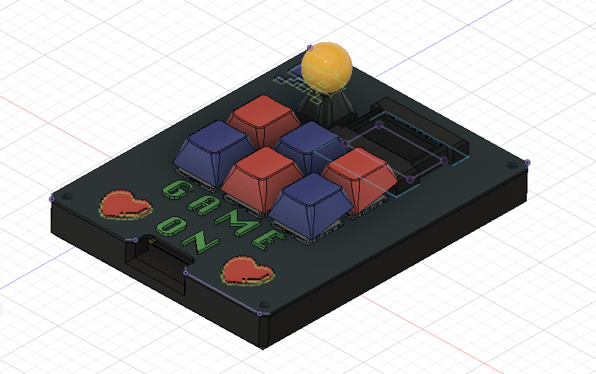
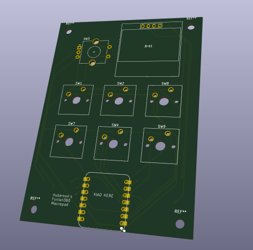

# Arcadepad
Arcadepad is a 6 key retro-themed macropad. It comes with a rotary encoder, an OLED display, and utilizes kmk firmware

This design was inspired by HackClub's HackPad tutorial
## Cad Model: Fusion 360

This macropad consists of 2 printed pieces, the case, which holds the PCB, and the cover. The PCB screws into 4 mounting holes, which will be filled with M3 bolts and heatset inserts, located at the bottom of the cover, not visible in picture. The case is held together with 4 more heatset inserts and M3 boots. 
## PCB: KiCad

## Bill Of Materials
- Cherry MX Switches(6)
- Blank DSA Keycaps(6)
- Seeed XIAO RP2040(1)
- EC11 Rotary Encoder(1)
- SSD1306 OLED Display(1)
- M3X13 Screws(8)
- M3x5mmx4mm Heatset Inserts(8)
- 3D Printes Case & Cover(1)